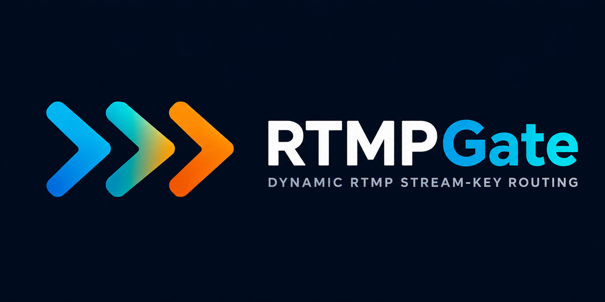

<p align="center">
  
</p>

<p align="center">
  
  
  
  
</p>

# RTMPGate

A lightweight RTMP ingest router.

RTMPGate accepts RTMP publishers like OBS or ffmpeg and forwards them to dynamically configured upstream RTMP targets.

```text
rtmp://ingest.example.com/live/customer-a
    -> rtmp://rtmp-a.internal/live/abc123

rtmp://ingest.example.com/live/customer-b
    -> rtmp://rtmp-b.internal/live/xyz789
```

No nginx reloads.  
No giant media platform.  
No transcoding.

Just stream-key routing.

---

## What RTMPGate does

- accepts RTMP publishers
- validates stream keys
- resolves routes dynamically
- opens upstream RTMP publish connections
- relays media packets

---

## Why this exists

Most RTMP infrastructure falls into one of two categories:

- static nginx-rtmp setups
- large media platforms that do far more than simple routing

RTMPGate sits in the middle.

It is designed for cases where you only need:

```text
stream key -> upstream RTMP target
```

with a small HTTP API and production-friendly behavior.

Typical use cases:

- dynamic customer ingest routing
- ephemeral live-event infrastructure
- multi-region RTMP entrypoints
- internal relay/control planes
- Kubernetes-based ingest systems

---

## Features

- RTMP ingest
- RTMP upstream relay
- dynamic route management API
- Redis / Valkey / Memorystore support
- optional in-memory mode
- local route cache
- active RTMP session tracking
- Prometheus-compatible metrics
- configurable connection limits
- optional bearer authentication
- upstream host allowlist
- ffmpeg smoke test
- Detekt static analysis

---

# Quick Start

## Start local infrastructure

```bash
docker compose up -d valkey upstream-a
```

## Start RTMPGate

```bash
RTMPGATE_STORAGE=redis \
RTMPGATE_REDIS_URL=redis://localhost:6379 \
./gradlew run
```

## Create a route

```bash
curl -X PUT http://localhost:8080/v1/routes/test-key \
  -H "Content-Type: application/json" \
  -d '{"target":"rtmp://localhost:1936/live/test-target"}'
```

## Publish a test stream

```bash
ffmpeg -re \
  -f lavfi -i testsrc=size=1280x720:rate=30 \
  -f lavfi -i sine=frequency=1000 \
  -c:v libx264 -preset veryfast \
  -c:a aac \
  -f flv rtmp://localhost:1935/live/test-key
```

## Verify output

Open:

```text
http://localhost:8890/live/test-target/
```

---

# HTTP API

## Health

```http
GET /health
```

Returns:

- `200` when RTMPGate can accept traffic
- `503` when storage is unavailable or the instance is shutting down

---

## Metrics

```http
GET /metrics
```

Returns Prometheus-compatible metrics.

---

## Create or update a route

```http
PUT /v1/routes/{streamKey}
Content-Type: application/json
Authorization: Bearer <token>

{
  "target": "rtmp://upstream.example.com:1935/live/target-id"
}
```

The stream key is taken from the URL.

---

## Create a route with the key in the body

```http
POST /v1/routes
Content-Type: application/json
Authorization: Bearer <token>

{
  "streamKey": "test-key",
  "target": "rtmp://upstream.example.com:1935/live/target-id"
}
```

---

## Get a route

```http
GET /v1/routes/{streamKey}
```

---

## List routes

```http
GET /v1/routes
```

---

## Delete a route

```http
DELETE /v1/routes/{streamKey}
Authorization: Bearer <token>
```

Deleting a route prevents new publishers from connecting with that key.

Existing sessions continue running until disconnected.

---

## List active sessions

```http
GET /v1/sessions
```

---

## Terminate a session

```http
DELETE /v1/sessions/{sessionId}
Authorization: Bearer <token>
```

---

# Stream Key Rules

Stream keys:

- must start with a letter or digit
- must be between 1 and 128 characters
- may only contain:
  - letters
  - digits
  - `.`
  - `_`
  - `-`
  - `:`
  - `@`

---

# Environment Variables

| Variable | Default | Description |
|---|---:|---|
| `RTMPGATE_HTTP_HOST` | `0.0.0.0` | HTTP bind host |
| `RTMPGATE_HTTP_PORT` | `8080` | HTTP bind port |
| `RTMPGATE_RTMP_HOST` | `0.0.0.0` | RTMP bind host |
| `RTMPGATE_RTMP_PORT` | `1935` | RTMP bind port |
| `RTMPGATE_STORAGE` | `redis` | `redis`, `valkey`, or `memory` |
| `RTMPGATE_REDIS_URL` | `redis://localhost:6379` | Redis / Valkey / Memorystore URL |
| `RTMPGATE_ROUTE_CACHE_SECONDS` | `5` | Local route-cache TTL |
| `RTMPGATE_ADMIN_TOKEN` | unset | Enables bearer auth for write endpoints |
| `RTMPGATE_TARGET_HOST_ALLOWLIST` | unset | Comma-separated upstream host allowlist |
| `RTMPGATE_MAX_ACTIVE_SESSIONS` | `0` | Global RTMP session limit |
| `RTMPGATE_MAX_SESSIONS_PER_IP` | `0` | Per-IP RTMP session limit |
| `RTMPGATE_CONNECT_TIMEOUT_MS` | `5000` | Upstream connect timeout |
| `RTMPGATE_READ_TIMEOUT_MS` | `30000` | RTMP read timeout |
| `RTMPGATE_RTMP_DEBUG` | `false` | Verbose RTMP protocol logging |

---

# Production Notes

At minimum:

```bash
RTMPGATE_ADMIN_TOKEN=<long-random-token>

RTMPGATE_STORAGE=redis
RTMPGATE_REDIS_URL=redis://your-memorystore-host:6379

RTMPGATE_TARGET_HOST_ALLOWLIST=rtmp-a.internal.example.com,rtmp-b.internal.example.com

RTMPGATE_MAX_ACTIVE_SESSIONS=1000
RTMPGATE_MAX_SESSIONS_PER_IP=10
```

Recommended:

- keep the HTTP API private
- monitor `/metrics`
- use managed Redis/Valkey infrastructure
- run regular compatibility tests against OBS and ffmpeg

---

# Compatibility

| Publisher / Upstream | Status | Notes |
|---|---|---|
| ffmpeg | Tested | Included smoke test |
| OBS Studio | Recommended manual validation | Standard RTMP publish flow |
| Streamlabs | Recommended manual validation | OBS-derived RTMP flow |
| Larix Broadcaster | Recommended manual validation | Mobile RTMP publisher |
| MediaMTX upstream | Tested | Used during development |
| nginx-rtmp upstream | Recommended manual validation | Common RTMP target |

---

# Development

## Run tests

```bash
./gradlew test
```

## Run Detekt

```bash
./gradlew detekt
```

---

# License

RTMPGate is licensed under the Apache License 2.0.

See `LICENSE`.
