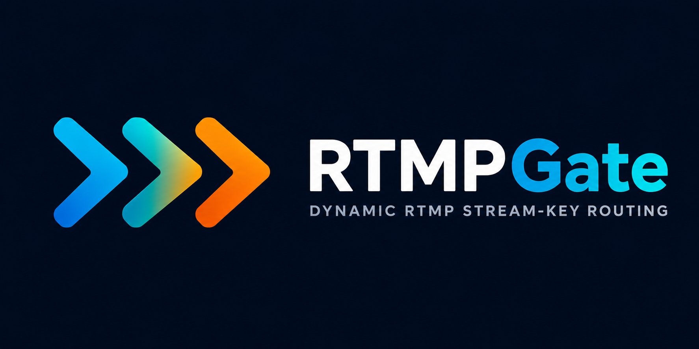

<p align="center">
  
</p>

<p align="center">
  
  
  
  
</p>

# RTMPGate

A lightweight RTMP ingest router.

RTMPGate accepts RTMP publishers like OBS or ffmpeg and forwards them to dynamically configured upstream RTMP targets.

```text
rtmp://ingest.example.com/live/customer-a
    -> rtmp://rtmp-a.internal/live/abc123

rtmp://ingest.example.com/live/customer-b
    -> rtmp://rtmp-b.internal/live/xyz789
```

No nginx reloads.  
No giant media platform.  
No transcoding.

Just stream-key routing.

---

## What RTMPGate does

- accepts RTMP publishers
- validates stream keys
- resolves routes dynamically
- opens upstream RTMP publish connections
- relays media packets

---

## Why this exists

Most RTMP infrastructure falls into one of two categories:

- static nginx-rtmp setups
- large media platforms that do far more than simple routing

RTMPGate sits in the middle.

It is designed for cases where you only need:

```text
stream key -> upstream RTMP target
```

with a small HTTP API and production-friendly behavior.

Typical use cases:

- dynamic customer ingest routing
- ephemeral live-event infrastructure
- multi-region RTMP entrypoints
- internal relay/control planes
- Kubernetes-based ingest systems

---

## Features

- RTMP ingest
- RTMP upstream relay
- dynamic route management API
- Redis / Valkey / Memorystore support
- optional in-memory mode
- local route cache
- active RTMP session tracking
- Prometheus-compatible metrics
- configurable connection limits
- optional bearer authentication
- upstream host allowlist
- ffmpeg smoke test
- Detekt static analysis

---

# Quick Start

## Start local infrastructure

```bash
docker compose up -d valkey upstream-a
```

## Start RTMPGate

```bash
RTMPGATE_STORAGE=redis \
RTMPGATE_REDIS_URL=redis://localhost:6379 \
./gradlew run
```

## Create a route

```bash
curl -X PUT http://localhost:8080/v1/routes/test-key \
  -H "Content-Type: application/json" \
  -d '{"target":"rtmp://localhost:1936/live/test-target"}'
```

## Publish a test stream

```bash
ffmpeg -re \
  -f lavfi -i testsrc=size=1280x720:rate=30 \
  -f lavfi -i sine=frequency=1000 \
  -c:v libx264 -preset veryfast \
  -c:a aac \
  -f flv rtmp://localhost:1935/live/test-key
```

## Verify output

Open:

```text
http://localhost:8890/live/test-target/
```

---

# HTTP API

## Health

```http
GET /livez     # liveness  — 200 while the process is alive (never depends on Redis)
GET /readyz    # readiness — 200 when able to accept traffic, 503 otherwise
GET /health    # alias of /readyz (kept for backward compatibility)
```

`/readyz` returns:

- `200` when RTMPGate can accept traffic
- `503` when storage is unavailable or the instance is shutting down

Use `/livez` for the Kubernetes liveness probe and `/readyz` for readiness — a storage outage
should drain traffic (readiness) without restarting the pod (liveness).

---

## Metrics

```http
GET /metrics
```

Returns Prometheus-compatible metrics.

---

## Create or update a route

```http
PUT /v1/routes/{streamKey}
Content-Type: application/json
Authorization: Bearer <token>

{
  "target": "rtmp://upstream.example.com:1935/live/target-id"
}
```

The stream key is taken from the URL.

---

## Create a route with the key in the body

```http
POST /v1/routes
Content-Type: application/json
Authorization: Bearer <token>

{
  "streamKey": "test-key",
  "target": "rtmp://upstream.example.com:1935/live/target-id"
}
```

---

## Get a route

```http
GET /v1/routes/{streamKey}
```

---

## List routes

```http
GET /v1/routes
```

---

## Delete a route

```http
DELETE /v1/routes/{streamKey}
Authorization: Bearer <token>
```

Deleting a route prevents new publishers from connecting with that key.

Existing sessions continue running until disconnected.

---

## List active sessions

```http
GET /v1/sessions
```

---

## Terminate a session

```http
DELETE /v1/sessions/{sessionId}
Authorization: Bearer <token>
```

---

# Stream Key Rules

Stream keys:

- must start with a letter or digit
- must be between 1 and 128 characters
- may only contain:
  - letters
  - digits
  - `.`
  - `_`
  - `-`
  - `:`
  - `@`

---

# Environment Variables

| Variable                           |                  Default | Description                                         |
|------------------------------------|-------------------------:|-----------------------------------------------------|
| `RTMPGATE_HTTP_HOST`               |                `0.0.0.0` | HTTP bind host                                      |
| `RTMPGATE_HTTP_PORT`               |                   `8080` | HTTP bind port                                      |
| `RTMPGATE_RTMP_HOST`               |                `0.0.0.0` | RTMP bind host                                      |
| `RTMPGATE_RTMP_PORT`               |                   `1935` | RTMP bind port                                      |
| `RTMPGATE_STORAGE`                 |                  `redis` | `redis`, `valkey`, or `memory`                      |
| `RTMPGATE_REDIS_URL`               | `redis://localhost:6379` | Redis / Valkey / Memorystore URL                    |
| `RTMPGATE_ROUTE_CACHE_SECONDS`     |                      `5` | Local route-cache TTL                               |
| `RTMPGATE_ADMIN_TOKEN`             |                    unset | Enables bearer auth for write endpoints             |
| `RTMPGATE_REQUIRE_READ_AUTH`       |                  `false` | Also require the bearer token on read endpoints     |
| `RTMPGATE_TARGET_HOST_ALLOWLIST`   |                    unset | Comma-separated upstream host allowlist             |
| `RTMPGATE_MAX_ACTIVE_SESSIONS`     |                      `0` | Global RTMP session limit                           |
| `RTMPGATE_MAX_SESSIONS_PER_IP`     |                      `0` | Per-IP RTMP session limit                           |
| `RTMPGATE_CONNECT_TIMEOUT_MS`      |                   `5000` | Upstream connect timeout                            |
| `RTMPGATE_READ_TIMEOUT_MS`         |                  `30000` | RTMP read timeout                                   |
| `RTMPGATE_RTMP_DEBUG`              |                  `false` | Verbose RTMP protocol logging                       |
| `RTMPGATE_STARTUP_BUFFER_BYTES`    |               `67108864` | Max buffered media bytes while upstream connects    |
| `RTMPGATE_STARTUP_BUFFER_MESSAGES` |                   `4096` | Max buffered media messages while upstream connects |
| `RTMPGATE_MAX_INPUT_BUFFER_BYTES`  |                `8388608` | Max unparsed inbound bytes before the session is cut |
| `RTMPGATE_MAX_RTMP_MESSAGE_BYTES`  |               `16777216` | Max single RTMP message size accepted               |
| `RTMPGATE_GRACEFUL_SHUTDOWN_MS`    |                  `15000` | Drain window for active sessions on SIGTERM         |

---

# Kubernetes

RTMPGate ships first-class Kubernetes packaging:

- **Helm chart** — [`deploy/helm/rtmpgate`](deploy/helm/rtmpgate) (published as an OCI artifact
  to `oci://ghcr.io/dersimeon/charts`):

  ```bash
  helm install rtmpgate oci://ghcr.io/dersimeon/charts/rtmpgate \
    --version 0.1.0 \
    --set secret.adminToken="$(openssl rand -hex 32)" \
    --set secret.redisUrl="redis://my-redis:6379"
  ```

- **Kustomize** — see [`deploy/kustomize/README.md`](deploy/kustomize/README.md) for consuming
  the chart via `helmCharts` inflation or a committed post-rendered base.

The RTMP plane needs a `LoadBalancer`/`NodePort` (RTMP is not HTTP, so an Ingress cannot route
it); the HTTP control plane is a ClusterIP kept internal. Liveness uses `/livez`, readiness
uses `/readyz`, and rolling updates drain in-flight publishers via the graceful-shutdown window.

---

# Production Notes

At minimum:

```bash
RTMPGATE_ADMIN_TOKEN=<long-random-token>

RTMPGATE_STORAGE=redis
RTMPGATE_REDIS_URL=redis://your-memorystore-host:6379

RTMPGATE_TARGET_HOST_ALLOWLIST=rtmp-a.internal.example.com,rtmp-b.internal.example.com

RTMPGATE_MAX_ACTIVE_SESSIONS=1000
RTMPGATE_MAX_SESSIONS_PER_IP=10
```

Recommended:

- keep the HTTP API private
- monitor `/metrics`
- use managed Redis/Valkey infrastructure

---

# Compatibility

| Publisher / Upstream | Status | Notes                                           |
|----------------------|--------|-------------------------------------------------|
| ffmpeg               | Tested | Automated compatibility suite and soak coverage |
| OBS Studio           | Tested | Manual compatibility validation completed       |
| Streamlabs           | Tested | Manual compatibility validation completed       |
| Larix Broadcaster    | Tested | Mobile RTMP validation completed                |
| Livestream Studio    | Tested | Manual compatibility validation completed       |
| MediaMTX upstream    | Tested | Used during development and soak testing        |
| nginx-rtmp upstream  | Tested | Upstream relay validation completed             |

---

# Soak Test Matrix

| Profile           | Streams |  Ramp | Video                | Audio   | Result | RTMPGate Peak CPU | RTMPGate Limits |
|-------------------|--------:|------:|----------------------|---------|--------|-------------------|-----------------|
| Tiny baseline     |     110 |  1.0s | 160x90 @ 5fps 80k    | 16k AAC | Passed | ~8%               | 1 CPU / 3 GB    |
| Tiny high-density |     250 | 0.25s | 160x90 @ 5fps 80k    | 16k AAC | Passed | ~13%              | 1 CPU / 3 GB    |
| 360p density      |     250 | 0.25s | 640x360 @ 10fps 350k | 32k AAC | Passed | ~46-57%           | 1 CPU / 3 GB    |

All runs:
- 0 failed streams
- 0 probe failures
- 0 restarts
- MediaMTX upstream validation enabled
- ffprobe validation enabled

---

# Development

## Run tests

```bash
./gradlew test
```

## Run Detekt

```bash
./gradlew detekt
```

---

# License

RTMPGate is licensed under the Apache License 2.0.

See `LICENSE`.
